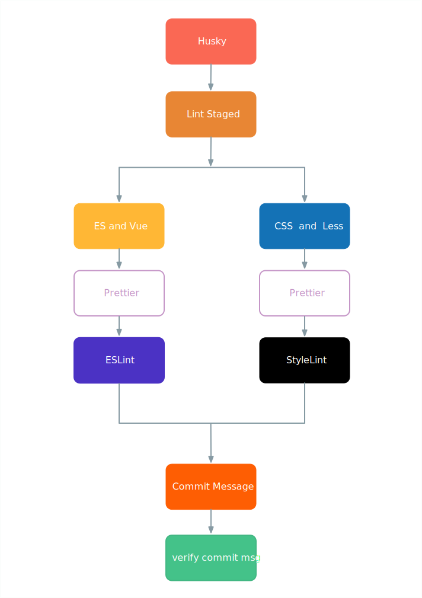

# 阅前指南

随着前端项目体积的增长，新人的融入，代码风格越来越多变，这造成了团队协作上的效率显著下降，也提升了人员间的沟通成本。考虑到历史遗留成本及人员适应度，一份前端规范呼之欲出。

## 规范指引

前端规范主要由以下五份规范组合而成：

- [ES 规范](https://pets-web.github.io/tms-style-guide/js/)

- [Vue 规范](https://pets-web.github.io/tms-style-guide/js/vue.html)

- [CSS 规范](https://pets-web.github.io/tms-style-guide/css/)

- [Less 规范](https://pets-web.github.io/tms-style-guide/css/less.html)

- [Git 工作流](https://pets-web.github.io/tms-style-guide/git/)

## 规范说明

- ES 及 Vue 规范通过 [ESLint](https://eslint.org/) 在项目中落定生效

- CSS 及 Less 规范通过 [StyleLint](https://stylelint.io/) 在项目中落定生效

- Git Commit 规范通过 [Husky](https://github.com/typicode/husky) 在项目中落定生效

- 代码格式化通过 [Prettier](https://prettier.io/) 在项目中落定生效

## 工程化流程

## Lint 库

为了加速前端规范的落地，提供 ESLint 及 StyleLint 两个 npm 包，如下：

- [eslint-config-kanas](https://github.com/snowball1990/eslint-config-kanas)

- [stylelint-config-kanas](https://github.com/snowball1990/stylelint-config-kanas)

